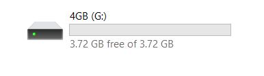
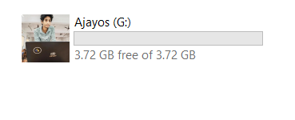

# USB-Configurator

This repository contains a tool that allows you to change the name and image of your USB device easily. With this tool, you can personalize your USB device and give it a unique identity.

## Usage

Follow these steps to change the name and image of your USB device:

1. Connect your USB device to your computer.

2. Copy your desired image file to the root directory of the USB device and convert it to the .ico format. Make sure to name the .ico file as `mypic.ico`. You can use online converters or image editing software to convert the image to .ico format. eg:  [`convertio`](https://convertio.co/)

3. Create a new text file named `autorun.inf` in the root directory of the USB device.

4. Open the `autorun.inf` file using a text editor and write the following lines:

```
[autorun]
icon=mypic.ico
label=Ajayos
```

### Here `mypic.ico` rename with your image name and `Ajayos` rename with your name

5. Save the `autorun.inf` file.

6. Safely disconnect and reconnect your USB device to apply the changes. The USB device should now have the new name and image.

**Before and After Images:**

| Before                      | After                      |
| --------------------------- | -------------------------- |
|  |   |


**Note**: Be cautious when executing autorun.inf files from external sources as they can be potential security risks. Ensure that the autorun.inf file is created by you or a trusted source.
